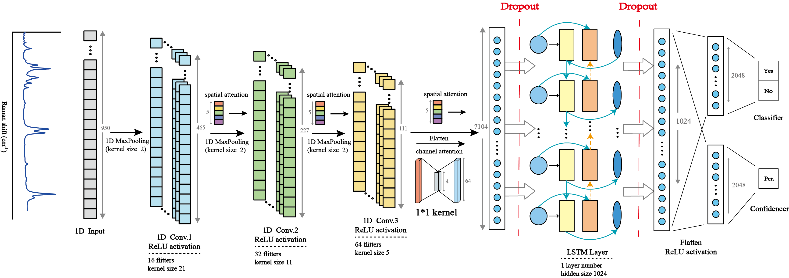

# DA-ConvLSTM-for-Raman-Identification
## Overview
To the demand for the automated identification of specific minerals from Raman spectroscopy data,
we proposed a Dual-Attention Convolutional Long Short-Term Memory (DA-ConvLSTM) network to improve the precision of mineral identification. 
**Importantly, this model is capable of detecting the presence of specific minerals within mixtures, making it highly effective for complex sample analysis.**


## Key Features
- **Model Architecture:** Integration of convolutional neural networks (CNNs) and long short-term memory (LSTM) networks with attention mechanisms.
- **1D Grad-Cam Visualization:** Allows for the interpretation of model decisions by visualizing important regions in the Raman spectra.
- **Dataset Utilization:** Uses the Machine Learning Raman Open Dataset (MLROD) and RRUFF Project Raman Database for training and evaluation.

## Installation
To set up the project environment:
1. Clone the repository:
   ```bash
   git clone https://github.com/duangtg/DA-ConvLSTM-for-Raman-Identification.git
   ```
2. Install required Python packages:
   ```bash
   conda install --yes --file requirements.txt
   ```

- Python 3.9 is recommended [Python](https://www.python.org)
- Ensure you have a 2.0.0+ version PyTorch [PyTorch](https://pytorch.org)

## Usage
To run the model training and evaluation scripts:
   ```bash
   python train.py
   python predict.py
   ```

1D-GradCam used to show the important region for model decision can be generated:
   ```bash
   python Cam_generate.py
   ```

## Data
The datasets used in this study can be accessed from the following sources:
- **MLROD Dataset:**[Download Link](https://odr.io/MLROD)
- **RRUFF Database:**[Visit Site](https://rruff.info/)

## Paper
[Deep learning-assisted Raman spectroscopy for automated identification of specific minerals](https://www.sciencedirect.com/science/article/pii/S1386142525001490)

## Contact
Zhen-hong Du: [duzhenhong@zju.edu.cn](mailto:duzhenhong@zju.edu.cn)
